# Block Ciphers

https://www.youtube.com/watch?v=oVCCXZfpu-w

# Feistel Cipher

## Overwiev

Its not actually a cipher itself, its kind of a framework for building a cipher. It is a strcuture, and then you put some encryption rounds and key etc. and you have a cipher

**Formalna defka**

is a symmetric structure used in the construction of [block ciphers](https://en.wikipedia.org/wiki/Block_cipher). In a Feistel cipher, encryption and decryption are very similar operations, and both consist of iteratively running a function called a "round function" * a fixed number of times.

*(pewnie ta funkcja `Fs` niżej)

## Steps

1. Divide `plaintext` into two parts: `L`0 and `R0`
2. `R0` is encoded using `fs(R0)`, and stored in `E` (`E=fs(R0)`)
3. `L1 = R0` and `R1 = L0 XOR E`
4. Concatenate `L1` and `R1` to obtain the `ciphertext`

### 1


```python
plaintext = 011110100001
L0 = 011110
R0 = 100001
```

### 2 

`fs` to jakaś generyczna funkcja, którą możesz sobie wymyśleć. Ale chyba to jest permutacja, czyli przestawianie bitów (inny ordering), a nie jakieś liczenie czegoś

No i babka na filmiku sobie wymyśliła taką permutacje `(A,B,C) --> (C,A,B)

```pyt
E = fs(R0) = 010100
```

### 3

```python
L1 = R0 = 100001
R1 = L0 XOR E = 011110 xor 010100 = 001010
```

### 4

```
ciphertext = L1R1 = 100001001010
```

### Summary

To co opisano w steps to była jedna runda i można zaprezentowć ją tak:

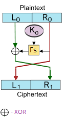

Zauważ, że teraz L1 i R1 może być inputem do kolejnej rundy. 

> Camellia ma właśnie takowych rund 18

To co też warto zauważyć, to że w naszym przykładzie nie brano żadnego klucza. Normalnie ta funkcja Fs, którą my sobie wzieliśmy taką prostą korzysta z klucza. 

## Słownie

A Feistel network uses a *round function*, a function which takes two inputs – a data block and a subkey – and returns one output of the same size as the data block. In each round, the round function is run on half of the data to be encrypted, and its output is XORed with the other half of the data. This is repeated a fixed number of times, and the final output is the encrypted data.

Ważna zaletą porównując z innymi cipher designs jak np. [substitution–permutation networks](https://en.wikipedia.org/wiki/Substitution–permutation_network) jest to, że **the entire operation is guaranteed to be invertible (that is, encrypted data can be decrypted), even if the round function is not itself invertible.**

Stąd więc *round function* can be made arbitrarily complicated, since it does not need to be designed to be invertible. 

Co więcej encryption i decryption są bardzo podobne,  even identical in some cases, wymagając jedynie reversal of the [key schedule](https://en.wikipedia.org/wiki/Key_schedule)

## Construction details

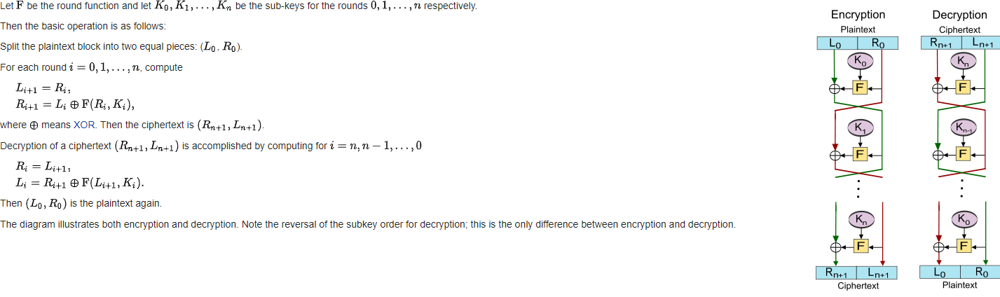

## Misc

**Unbalanced** Feistel ciphers use a modified structure where `L0` and `R1` are not of equal lengths.

# Pojęcia potrzebne do zrozumienia Camelli

## Confussion
W 1945 Claude Shannon opublikował groundbreaking paper on Information Theory. Jako esential property of secure cipher wskazywał on tzw. **confusion**. "Confusion" oznacza, że relationship pomiędzy `key` a `ciphertext` powinna być tak complex jak tylko się da. Given just a ciphertext, there should be no way to learn anything about the key.

If a cipher has poor confusion, it is possible to express a relationship between ciphertext, key, and plaintext as a linear function. For instance, in a Caesar cipher, `ciphertext = plaintext + key`. That's an obvious relation, which is easy to reverse.

## Diffusion
The other crucial property described by Shannon is "**diffusion**" -  This relates to how every part of a cipher's input should spread to every part of the output. Czyli confussion na jednym bajcie szyfrowanego bloku, powinna spread, distribute na inne bajty tego bloku, a nawet i na inne bloki.

## S-box

**S-box** (**substitution-box**) is a basic component of [symmetric key algorithms](https://en.wikipedia.org/wiki/Symmetric_key_algorithm) which performs substitution. In [block ciphers](https://en.wikipedia.org/wiki/Block_cipher), they are typically used to obscure the relationship between the key and the [ciphertext](https://en.wikipedia.org/wiki/Ciphertext), thus ensuring [Shannon's](https://en.wikipedia.org/wiki/Claude_Shannon) property of [confusion](https://en.wikipedia.org/wiki/Confusion_and_diffusion). Mathematically, an S-box is a vectorial [Boolean function](https://en.wikipedia.org/wiki/Boolean_function)

Np.

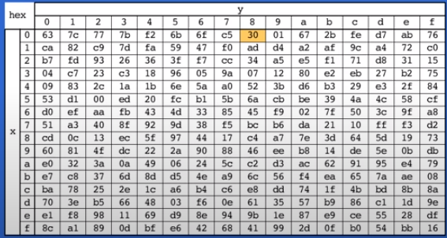

wektor `xy=08` jest zamieniany na `30`

## Affine transformations

In [Euclidean geometry](https://en.wikipedia.org/wiki/Euclidean_geometry), an **affine transformation** or **affinity** (from the Latin, *affinis*, "connected with") is a [geometric transformation](https://en.wikipedia.org/wiki/Geometric_transformation) that preserves [lines](https://en.wikipedia.org/wiki/Line_(geometry)) and [parallelism](https://en.wikipedia.org/wiki/Parallelism_(geometry)), but not necessarily [Euclidean distances](https://en.wikipedia.org/wiki/Euclidean_distance) and [angles](https://en.wikipedia.org/wiki/Angle).

https://www.youtube.com/watch?v=AheaTd_l5Is

Czyli Affine transformation to jest taka transformacja obiektu N wymiarowego, że zachowuje (preserve) tylko rzeczy N-1 wymiarowe, a te wyżej wymiarowe (N) już nie. Tak jak na filmiku, rusza się 2d płaszczyzna i jest zachowane, ale to co pod spodem się dzieje, to już nas nie obchodzi i to niech się tam zmienia jak chce.

## Key-whitening

Key whitening is an extremely simple technique to make block ciphers like DES much more resistant against brute-force attacks.

The most common form of key whitening is [xor-encrypt-xor](https://en.wikipedia.org/wiki/Xor-encrypt-xor) -- using a simple [XOR](https://en.wikipedia.org/wiki/XOR) before the first round and after the last round of [encryption](https://en.wikipedia.org/wiki/Encryption).

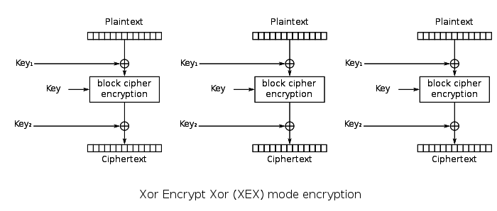

In addition to the regular cipher key kk, two whitening keys k1k1 and k2k2 are used to ⊕⊕ (XOR-mask) the plaintext and ciphertext.

https://crypto.stackexchange.com/questions/18497/how-exactly-does-key-whitening-manage-to-increase-security <-- w książce też to jest

## LInear Transformations

Can be thought as functions on a vector spaces.

Tak jak funkcja bierze skalar `x` i transformuje go w sklara `y`, tak Linear Transformation bierze zbiór wektórów i transformuje go na inny zbiór wektorów. Z tym że UWAGA, niekoniecznie musza to być vectory o tym samym Dimension (wymiarze), czyli np. Linear Transformation może wiąć wektory (2x2) a oddać skalary, albo wziąć wektor N-wymiarowy i oddać N*N-wymiarowy.

Dlatego mówimy że to są funkcje na vector spaces (bo razem z wektorami zmieniają ich przestrzenie).

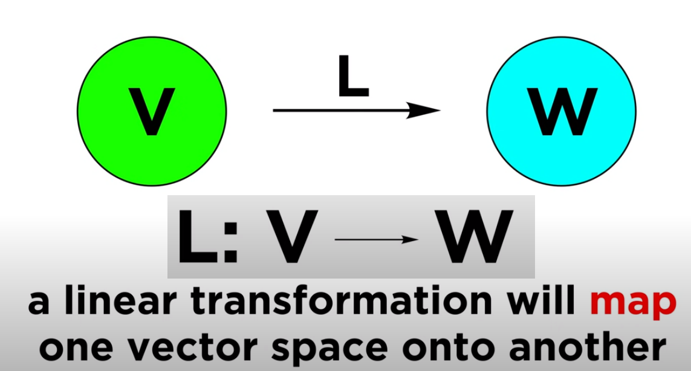

L będzie zawsze brać wektory z vector space `V` a oddawać z vector space `W` exaple:

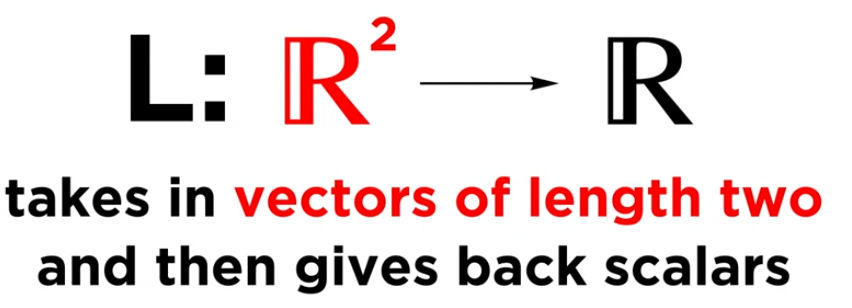

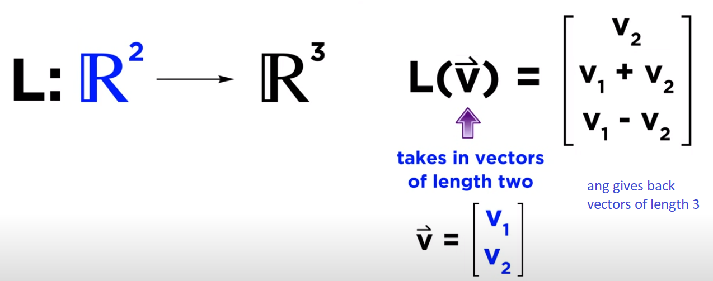

No i żeby to było **Linear** to musi być spełniony taki warunek:

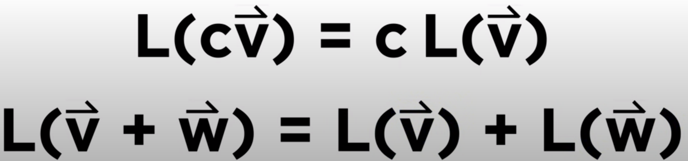

### Reprezentacja jako macierze

Fajne jest to że linear transformations można reprezentować jako macierze.

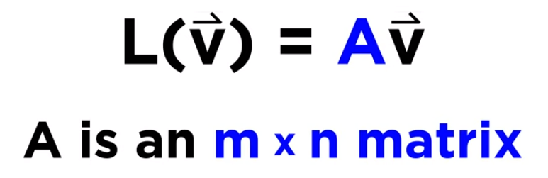

Robi się to za pomocą liczenia bazy danej vector space:

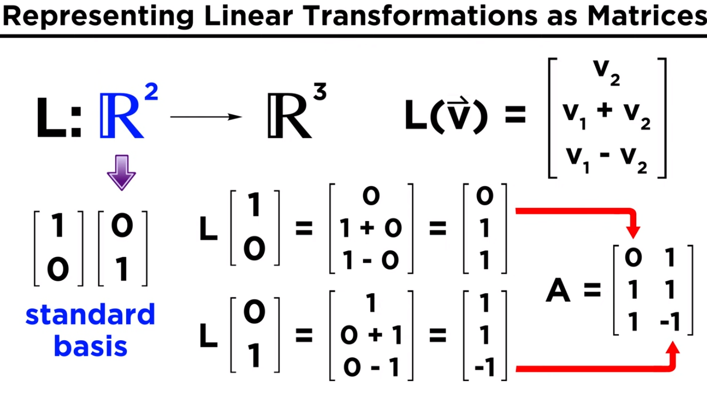

### Branch number of a matrix

https://onlinelibrary.wiley.com/doi/epdf/10.1002/sec.1561"Branch number helps to define the diffusion rate and gives a method to measure security against linear and differential cryptoanalysis. Another diffusion measure is the number of fixed points which indicates the cryptographic quality of linear transformations and is correlated with the cryptographic properties. In general finding diffusion layers having maximum branch numbers with a low number of fixed points in an important issue."

## Key Schedule

In [cryptography](https://en.wikipedia.org/wiki/Cryptography), the so-called [product ciphers](https://en.wikipedia.org/wiki/Product_cipher) are a certain kind of cipher, where the (de-)ciphering of data is typically done as an iteration of ***rounds***.

The setup for each round is generally the same, except for round-specific fixed values called a **round constant**, and round-specific data derived from the [cipher key](https://en.wikipedia.org/wiki/Key_(cryptography)) called a **round key**.

A **key schedule** is an algorithm that calculates all the round keys from the key.

# RFC 3713

## 1 Intro

Block size = 128-bit

Key size = 128/192/256bit

## 2 Algorithm Description

Camelia can be divided into:

- key scheduling part
- data randomizing part

### 2.1 Terminology

Operatory:

- `&` bitwise AND operation
- `|` bitwise OR operation
- `^` bitwise XOR operation
- `<<` logical left shift operation
  - A **shift left logical** of one position moves each bit to the left by one. The  right-most bit is replaced by a zero bit and the left-most bit is discarded.
  - 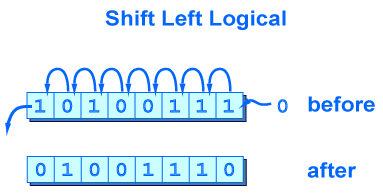

- `>>` logical right shift operation

  - To o ile zrobić shift mówi Ci to co stoi po prawej stronie operanda

    - ```
      1011 >> 1 = 0101
      1011 >> 3 = 0001
      ```

- `<<<` left rotation operation

  - Tak jak logical left shift tylko, że zamiast wypełaniania zerami i discard, bity przechodzą na drugą stronę (zapętlają się)
  - 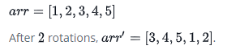

- `~` bitwise complement (zaprzeczenie)
- `0x` hexadecimal representation
- `||` concatenation

Jeszcze dokument definiuje kilka stałych:

- `MASK8 =   0xff`
- `MASK32 =  0xffffffff`
- `MASK64 =  0xffffffffffffffff`
- `MASK128 = 0xffffffffffffffffffffffffffffffff`

> zauważ, ze 0xff = bin11111111

### 2.2 Key Scheduling part

#### 2.2.1 Derive KL and KR variables

At the beginning, the 128-bit variables `KL` and `KR` are defined as follows:

- 128-bit key K:
  - KL = K
  - KR = 0
- 192-bit key K:
  - KL = K >> 64
  - KR = (( K & MASK64 ) || ( ~ ( K & MASK64 ) )                         //tutaj jak na moje jakieś błędy w RFC 3713

- 256-bit key K:
  - KL = K >> 128
  - KR = K & MASK128

> Uwaga:
>
> Jeśli masz krótszy wektor bitowy z dłuższym wektorem bitowym jakoś operacjonowany to wynik ma długość krótszego.
>
> Np. `0000 0000 0000 & 11 1111 = 0000 00` #PATRZ OD PRAWEJ, to po prawej jest najmniejsz znaczący bit i tam się zaczyna liczba

W wersji 128 `KL` jest po prostu kluczem `K`, a `KR` pustym wektorem (bo nie jest używany).

W wersji 192 `KL `jest po prostu 128 leftmost bitam z `K`*, a `KR` jest kontatenacją rightmost 64-bitów klucza `K` i zaprzeczeniem rightmost 64bitów klucza `K`

*jak masz same zera z lewej to możesz je ez usunąć

>Przykład
>
>```python
>K = 0101 1100 1101 #12bitów imitacja 192=12*16
>
>#KL i KR mają mieć więc 8 bitów 128=8*16
>
>KL = K >> 64 ==  0101 1100 1101 >> 4 = 0000 0101 1100 = 0101 1100
>
>KR = #tu nieco trudniej
>
>K & MASK64 = 0101 1100 1101 & 1111 = 1101 #(zauważ, że AND z wektorem {1}* to po prostu przycięcie go odpowiednio)
>
>~ ( K & MASK64 ) = 0010
>KR = 1101 0010
>```

W wersji 256 `KL` jest po prostu 128left-most bitam z K, a `KR` jest 128 rightmost bitam z K

Podsumuwując zmienne `KL` i `KR`

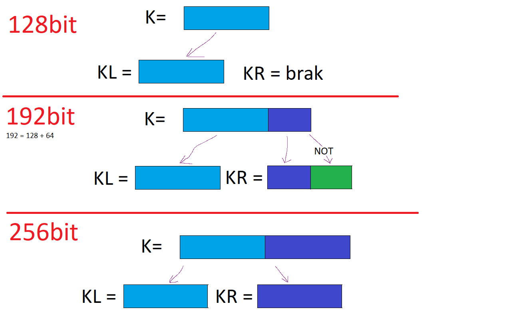

#### 2.2.2 Generate KA and KB variablesGene

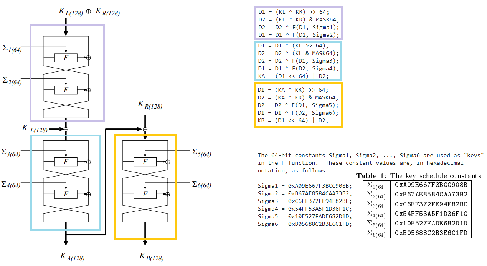

Przypomnij sobie Feistel Cipher. Jedna runda Feistel Cipher wygląda tak:


Potrzebuje on (jako struktura) fukncji `Fs`. W Cameilli jest to funkcja `F`, którą omówimy potem. 

Jak widać na obrazku generacja zmiennych `KA` i `KB` opiera się na trzech blokach po 2 rundy szyfru Feisela.

Jako klucze do funkcji `F` podawane są stałe sigma.

Plaintextem do pierwszego bloku jest `XOR(KL, KR)` i ma on 128bitów. To co wyjdzie z tego bloku też ma 28bitów jest XOR'owane z `KL` a następnie wchodzi do następnego bloku, to co wyjdzie już z tego bloku to jest klucz `KA`. W wersji 128 na tym się kończy, ponieważ `KB` występuje tylko w wersji 192 i 256bit. Teraz klucz `KA` jest XORowany z `KR` i to co wyjdzie idzie jako input do ostatniego bloku. To co wyjdzie z ostatniego bloku ma 128 bitów i jest kluczem `KB`.

#### 2.2.3 Generate subkeys

Dobra, mamy już zmienne `KL, KR, KA, KB` posłużą one do tego, aby wygenerować subkeys używane podczas encryption.

Pytanie najpierw jakie w ogóle będziemy potrzebować klucze?

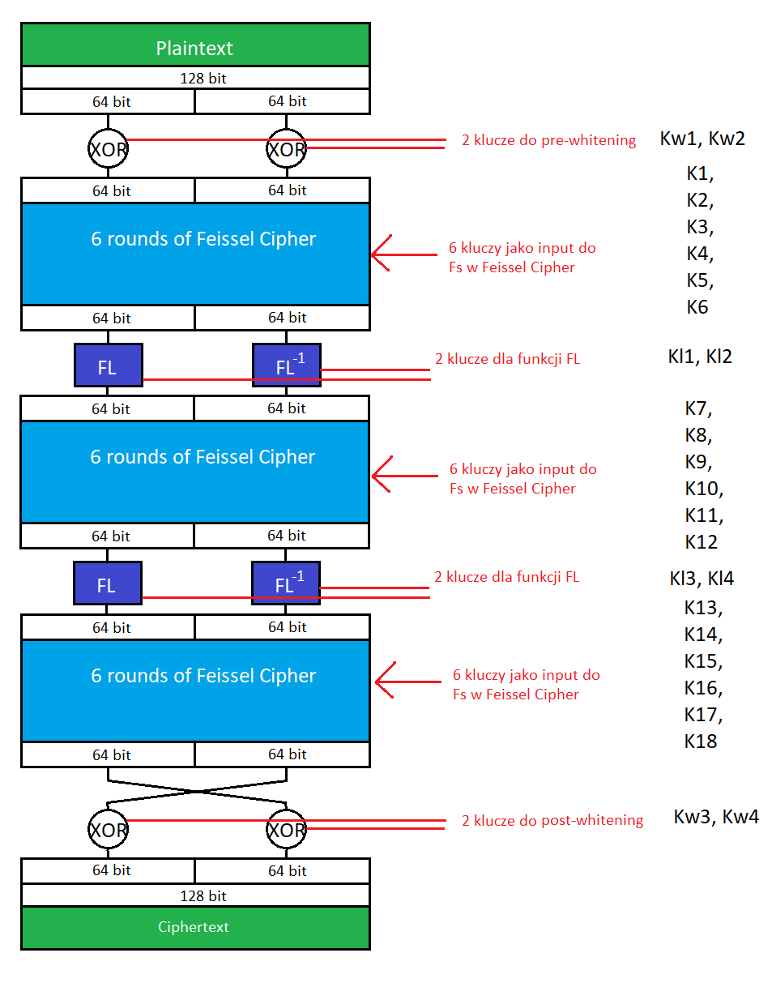

Obrazek wyżej jest dla wersji 128bit-key. Dla 192/256-bit dochodzi jeszcze jeden blok "6round of Feistel Cipher" oraz funkcje `FL` i `FL^(-1)` po nim. Dlatego dochodzą też klucze:

- `K19,K20,K21,K22,K23,K24`
- `Kl5, Kl6`

No dobra, ale jak te pod-klucze tworzymy?

> W sprawku tą tabelke dać jako Appendix będzie git.

Wszystkie te klucze mają długość 64bity.

RFC:  64-bit subkeys are generated by rotating KL, KR, KA, and KB and  taking the left- or right-half of them.

KL,KR,KA,KB są 128bitowe, więc jakaś ich rotacja a potem wzięcie połowy (lewej lub prawej) zwraca 64bitowe klucze.

Poniżej jest tabela dla 128-bit key, która w kolumnie `value` mówi o ile bitów w lewo zrotować oraz czy wiąć lewą (L) czy prawą (R) stronę

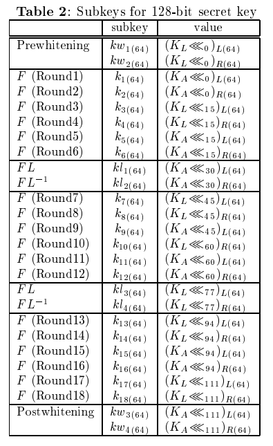

### 2.3 Data randomizing part (en/de-cryption part)

Dobra, mamy już klucze - teraz pyanie jak wygląda szyfrowanie

#### 2.3.1 Encryption

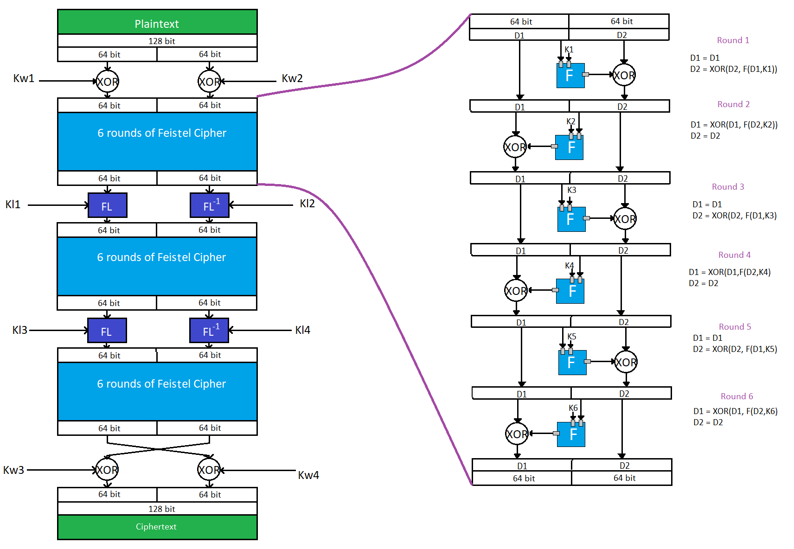

Tak wygląda encryption w wersji 128bit-key. W wersjiach 192/256 dochodzi jeszcze jeden blok z 6 rundami Feistel Cipher.

Wszystko widać na rysunku. 

To co pozostaje niewiadomą to dokładny opis funkcji `F` i `FL` oraz `FL^(-1)`.

#### 2.3.2 Decryption

The decryption procedure of Camellia can be done in the same way as the encryption procedure by reversing the order of the subkeys.

Dzieje się tak, bo https://pl.wikipedia.org/wiki/Sie%C4%87_Feistela

```python
	   kw1 <-> kw3
       kw2 <-> kw4
       k1  <-> k18
       k2  <-> k17
       k3  <-> k16
       k4  <-> k15
       k5  <-> k14
       k6  <-> k13
       k7  <-> k12
       k8  <-> k11
       k9  <-> k10
       kl1 <-> kl4
       kl2 <-> kl3
```

### 2.4 Components of Camellia

#### 2.4.1 F-Function

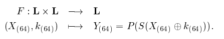

Funkcja F jako input bierze dwa wektory 64bitowe `(X i K)` i zwraca jeden wektor 64bitowy `Y`.

Jak widać ta funkcja najpierw oblicza `XOR(X,K)` i podaje go do funkcji `S`, a następnie to co wyjdzie z funkcji `S` idzie do funkcji `P`.

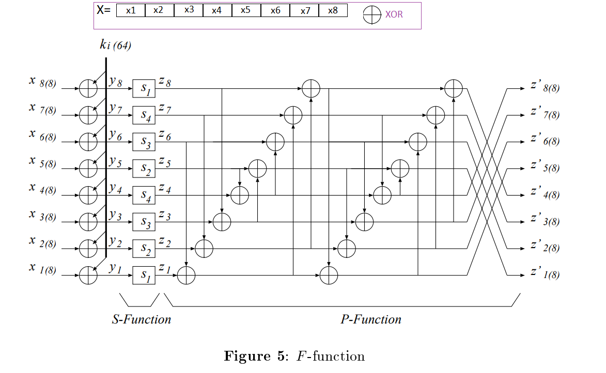

Tak wygląda ona w skali makro, ale rozbijmy ją na mniejsze komponenty.

> Na obrazku wychodzi na koniec `z` (bo taka jest notacja P-fucntion) ale w F-fucntion to to się składa na wektor wyjściowy `Y`

#### 2.4.2 S-Function

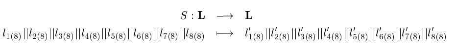

Czyli tutaj widać, że przekształca ona po 8 bitów wektora wejściowego.

Każde 8 bitów jest przetworzone niezależnie, a na sam koniec wszystkie są konkatenowane.

Funkcja opiera się na S-box'ach, których jest 4. 

S-boxy, czyli substitution box mapują wejściowe 8 bitów na wychodzą 8bitów ze statycznego przypisania. Oto one.

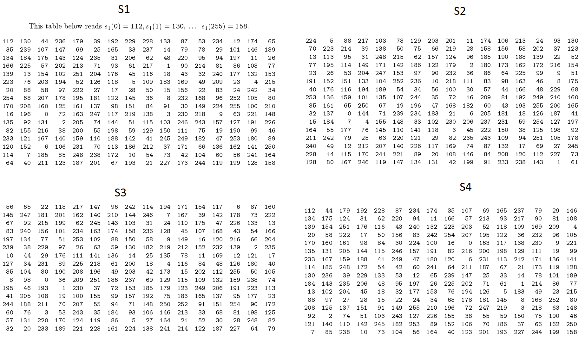

No i teraz te s-boxy są użyte w następujący sposób.

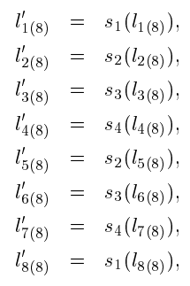

Czyli z kolejnością nie ma żadnych szacher-macher, ale różne S-boxy na różnych pozycjach są używane.

> Z tego co widzę to S-Function robi Confussion, a P-fucntion zrobi mocne diffusion.

#### 2.4.3 P-Function

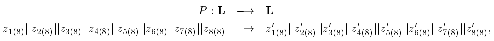

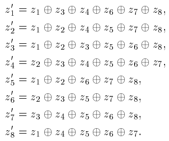

Też 64 bity wejściowe, dzieli na 8 części po 8 bitów i potem robie takie misz-masze różne XORowe.
